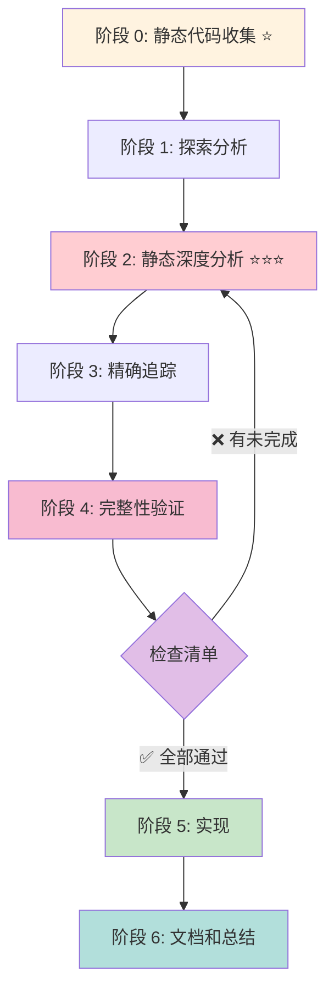
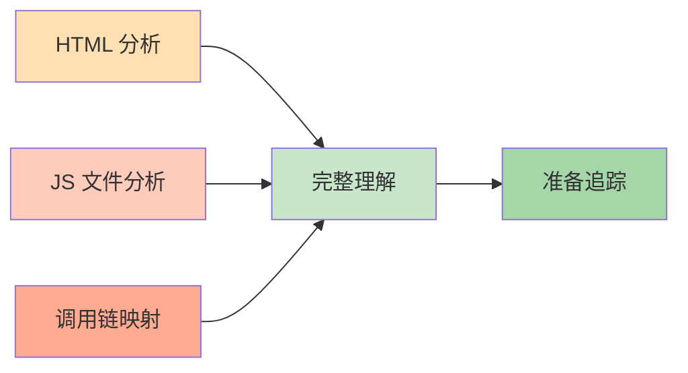
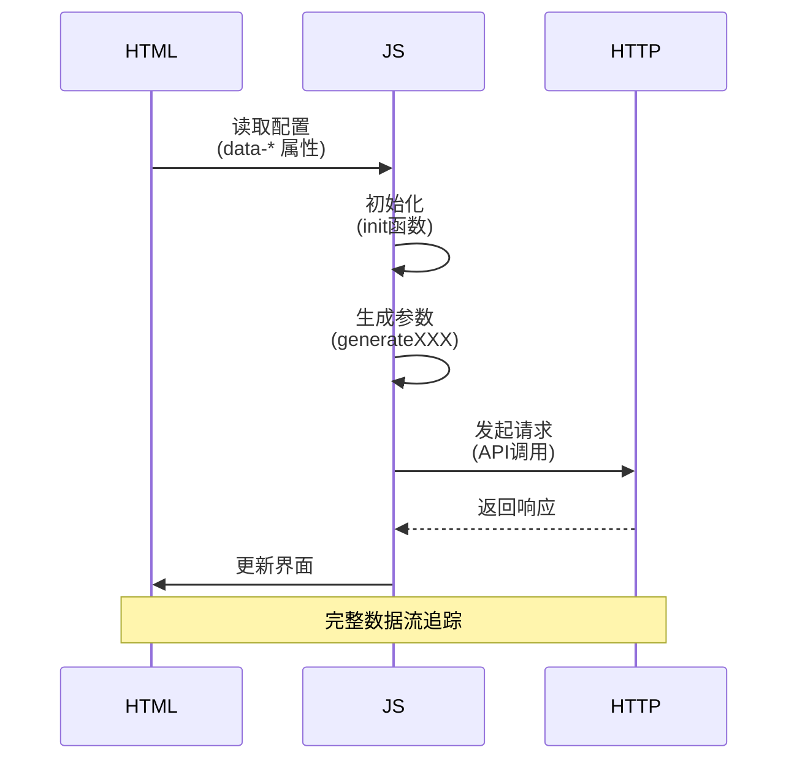
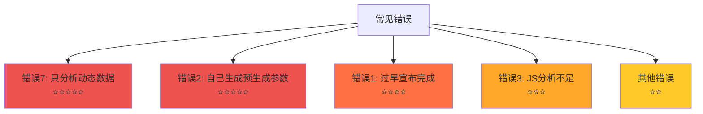
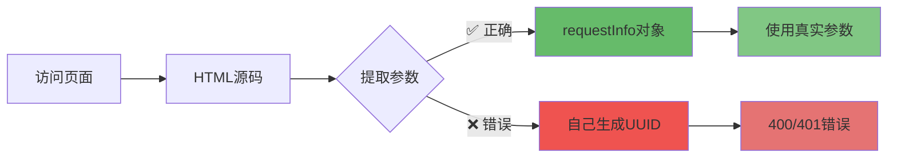

# 逆向分析项目标准化流程与规范

**版本**: 2.0  
**创建时间**: 2025-01-20  
**适用范围**: 自有或明确授权目标的 Web 调试、协议分析与接口复现  
**目的**: 提供可重复、可审计、证据驱动的分析流程和交付门禁

> 本文规定“怎么做”；工具开关和输出格式见 [AGENTS.md](AGENTS.md)，静态与动态分析的原因及反例见 [AGENTS_ERROR_7.md](AGENTS_ERROR_7.md)。

### 流程总览

```text
静态材料 → 探索采集 → 源码深析 → 定向追踪 → 完整性门禁 → 分层实现 → 验证交付
```

每个阶段都必须具有明确的**输入、动作、证据、产物和退出条件**。没有证据的结论只能标为“待验证”，不能进入实现。

---

## 目录

1. [项目组织结构规范](#1-项目组织结构规范)
2. [标准化的分析流程](#2-标准化的分析流程)
3. [必须生成的文档清单](#3-必须生成的文档清单)
4. [代码实现规范](#4-代码实现规范)
5. [完整的检查清单](#5-完整的检查清单)
6. [工具和命令](#6-工具和命令)
7. [常见陷阱和错误](#7-常见陷阱和错误)
8. [证据与协议文档规范](#8-证据与协议文档规范)
9. [快速检查表](#9-快速检查表)

---

## 1. 项目组织结构规范

### 1.1 目录结构

```
traceOut/
├── <站点名>/                          # 站点主目录
│   ├── <站点>-round1-<目的>/          # 第一轮采集
│   │   ├── jscall/
│   │   ├── http_packet/
│   │   └── ...
│   ├── <站点>-round2-<目的>/          # 第二轮采集
│   ├── <站点>-round3-<目的>/
│   │   └── ...
│   ├── <站点>-round1-<目的>.json      # 第一轮配置
│   ├── <站点>-round2-<目的>.json      # 第二轮配置
│   ├── <站点>_html_analysis.md        # HTML 分析文档
│   ├── <站点>_js_analysis_*.md        # JS 分析文档
│   ├── <站点>_call_chain.md           # 调用链文档
│   ├── <站点>_interface_analysis.md   # 接口分析文档
│   ├── <站点>_comparison.md           # 对比文档
│   ├── <站点>_validation.md           # 验证报告
│   ├── <站点>_lessons_learned.md      # 经验教训
│   ├── src/                           # 实现代码
│   │   ├── main.py
│   │   ├── api/
│   │   ├── models/
│   │   └── utils/
│   └── static/                        # 静态资源
│       ├── html/
│       └── js/
```

### 1.2 命名规范

#### 采集目录命名
```
格式: <站点>-round<N>-<目的>

示例:
  csair-round1-explore        ← 探索性采集
  csair-round2-targeted       ← 针对性追踪
  csair-round3-deep           ← 深度追踪
  csair-round4-aes            ← AES 算法追踪
  csair-round5-device         ← 设备指纹追踪
```

#### 配置文件命名
```
格式: <站点>-round<N>-<目的>.json

示例:
  csair-round1-explore.json
  csair-round2-targeted.json
```

#### 文档命名
```
格式: <站点>_<类型>.md

示例:
  csair_html_analysis.md
  csair_js_analysis_feilin.md
  csair_js_analysis_sg.md
  csair_call_chain.md
  csair_interface_analysis.md
```

### 1.3 MOZ_DOM_TRACE_FILE 配置

```json
{
  "MOZ_DOM_TRACE_FILE": "<站点主目录>\\<轮次子目录>\\trace"
}

实际示例:
  "MOZ_DOM_TRACE_FILE": "D:\\path\\to\\traceOut\\CSAIR\\csair-round1-explore\\trace"
```

**注意**: 实际输出在 `<轮次子目录>` 下，不是 trace 子目录！

---

## 2. 标准化的分析流程



**核心原则**: 静态分析在前，动态追踪在后！

### 阶段 0: 静态代码收集 ⭐ (在启动 RuyiTrace 之前)

**目标**: 收集所有静态代码资源

**检查清单**:
```
□ 访问目标网站
□ 右键 → 查看页面源代码
□ Ctrl+S 保存完整 HTML 到 static/html/
□ F12 → Sources 面板
□ 下载所有相关 JS 文件到 static/js/
□ 识别 JS 文件的混淆类型
□ 使用 js-beautify 格式化压缩的 JS
□ 创建文件清单（文件名、大小、URL、职责）
```

**输出**:
- `static/html/<站点>_page.html`
- `static/js/<脚本名>.js`
- `static/js/<脚本名>_beautified.js`
- `<站点>_file_list.md`

---

### 阶段 1: 探索分析 (第一轮 RuyiTrace 追踪)

**目标**: 理解系统整体架构和 HTTP 流程

**RuyiTrace 配置**:
```json
{
  "MOZ_DOM_TRACE": "1",
  "MOZ_DOM_TRACE_FILE": "<站点>/round1-explore/trace",
  "MOZ_DOM_HTTP_PACKET_TRACE": "1",
  "MOZ_DOM_JSCALL_TRACE": "1",
  "MOZ_DOM_JSCALL_LIMIT": "0",
  "MOZ_DOM_JSCALL_TARGET_ONLY": "0"
}
```

**操作步骤**:
```
1. 启动 RuyiTrace
2. 导入配置
3. 启动 Firefox
4. 打开目标页面
5. 完成一次完整的交互流程（如触发验证码）
6. 等待所有请求完成
7. 关闭 Firefox
8. 等待 3-5 秒（数据刷新）
```

**分析任务**:
```
□ 首先读取 trace_init，保存实际生效配置
□ 列出所有 HTTP 请求（按时间排序）
□ 识别关键接口及其作用
□ 绘制 HTTP 请求序列图和会话状态转换图
□ 识别所有加载的 JS 文件
□ 对动态字段做多样本差分（固定值/会话值/时间值/随机值/派生值）
□ 记录请求、响应和调用栈的证据路径
□ 确定下一轮的追踪目标
```

**输出**:
- `<站点>-round1-analysis.md`
- HTTP 接口列表
- JS 文件列表
- 追踪目标清单

---

### 阶段 2: 静态深度分析 ⭐⭐⭐ (最关键)

**目标**: 完整理解 HTML、JS 和 HTTP 的关联性



#### 2.1 HTML 分析 ⭐⭐⭐⭐⭐ (最重要)

**⚠️ 关键原则**: 
```
服务器预生成的参数必须从 HTML 中提取，不能自己生成！

常见的预生成参数：
- userId / userToken
- sessionId / certifyId
- nonce / traceid
- timestamp / expireTime
- 签名密钥 / appKey
```

**检查清单**:
```
□ 找到验证码/功能的根元素
□ 提取所有 data-* 属性
□ 提取内联 <script> 内容
□ ⭐ 识别配置对象（如 requestInfo, captchaConfig, window.xxx）
□ ⭐ 提取服务器预生成的参数（userId, sessionId, nonce 等）
□ ⭐ 记录这些参数与 HTTP 请求的映射关系
□ 提取关键常量（sceneId, appKey, accessKeyId 等）
□ 记录初始化函数调用
□ 列出所有外部 JS 引用
□ 记录 JS 加载顺序
```

**分析命令**:
```bash
# 提取 data-* 属性
grep -oP 'data-[\w-]+="[^"]*"' static/html/<站点>_page.html

# 提取内联脚本
sed -n '/<script>/,/<\/script>/p' static/html/<站点>_page.html

# 搜索配置对象
grep -E "config|Config|SETTINGS" static/html/<站点>_page.html
```

**输出**: `<站点>_html_analysis.md`

**必须包含**:
- 验证码容器的完整 HTML 代码
- ⭐⭐⭐ 服务器预生成参数的完整列表和说明
- ⭐⭐⭐ 预生成参数与 HTTP 请求参数的映射表
- 配置参数表格
- 初始化流程描述
- 外部 JS 文件清单

**示例 - 预生成参数映射表**:

| HTML 字段 | HTTP 参数名 | 来源 | 能否自己生成？ |
|-----------|------------|------|---------------|
| requestInfo.userId | UserId | 服务器预生成 | ❌ 不能 |
| requestInfo.userUserId | UserUserId | 服务器预生成 | ❌ 不能 |
| requestInfo.traceid | UserCertifyId | 服务器预生成 | ❌ 不能 |
| requestInfo.sceneId | SceneId | HTML 配置 | ❌ 不能 |
| - | AaduaneId | 客户端生成 | ✅ 可以 |
| - | DeviceData | 客户端生成 | ✅ 可以 |

---

#### 2.2 JS 文件深度分析

**对每个 JS 文件执行**:

**检查清单**:
```
□ 确定文件职责（一句话描述）
□ 记录文件大小和复杂度
□ 识别主要的导出函数/类
□ 识别依赖的其他模块
□ 提取关键函数（至少 10 个）
□ 分析每个关键函数的算法细节
□ 提取所有硬编码的常量
□ 识别数据结构
□ 绘制函数调用关系图
```

**关键函数类型**:
```
必须找到:
□ 初始化函数（init, initialize, setup）
□ 参数生成函数（generateXXX, createXXX）
□ 设备指纹函数（getFingerprint, collectDevice）
□ 签名计算函数（sign, signature, hmac）
□ 加密/解密函数（encrypt, decrypt, aes）
□ 请求构造函数（buildRequest, createParams）
□ 响应处理函数（handleResponse, parse）
```

**分析命令**:
```bash
# 美化 JS
js-beautify static/js/feilin.min.js > static/js/feilin.js

# 提取函数定义
grep -E "function\s+\w+|const\s+\w+\s*=\s*function" static/js/feilin.js > functions.txt

# 搜索关键算法
grep -i "signature\|encrypt\|device\|fingerprint\|secret\|key\|hmac\|aes" static/js/feilin.js

# 提取常量
grep -oP '(var|const|let)\s+\w+\s*=\s*"[^"]*"' static/js/feilin.js
```

**对每个关键函数**:
```
必须记录:
□ 函数名和位置（行号）
□ 输入参数（类型、来源、默认值）
□ 返回值（格式、用途）
□ 算法步骤（伪代码）
□ 使用的工具函数
□ 调用的其他函数
□ 错误处理逻辑
```

**输出**: `<站点>_js_analysis_<文件名>.md`

**必须包含**:
- 文件职责和概述
- 关键函数列表（表格）
- 每个函数的详细分析（包括伪代码）
- 常量清单（表格）
- 数据结构定义
- 函数调用关系图

---

#### 2.3 调用链映射

**目标**: 建立 HTML → JS → HTTP 的完整映射



**检查清单**:
```
□ HTML → JS 映射
  □ 哪个元素触发 JS 初始化？
  □ data-* 属性如何传递给 JS？
  □ 内联脚本如何调用外部 JS？

□ JS → HTTP 映射（对每个 HTTP 请求）
  □ 由哪个 JS 函数发起？
  □ 参数从哪里生成？
  □ 签名如何计算？
  □ Headers 如何设置？

□ 数据流追踪（对每个关键数据）
  □ 生成位置（文件、函数、行号）
  □ 传输路径（调用链）
  □ 使用位置（哪个请求）
  □ 格式转换（JSON/Base64/加密）

□ 流程图
  □ HTML 初始化流程图
  □ JS 调用序列图
  □ HTTP 请求依赖图
  □ 数据流转示意图
```

**输出**: `<站点>_call_chain.md`

**必须包含**:
- HTML → JS 映射表
- JS → HTTP 映射表
- 每个关键数据的完整追踪
- 流程图（Mermaid 或图片）

---

### 阶段 3: 精确追踪 (第二轮~第N轮)

**目标**: 用 RuyiTrace 验证静态分析，追踪关键函数

**基于阶段 2 的分析配置追踪**:

**RuyiTrace 配置模板**:
```json
{
  "MOZ_DOM_TRACE": "1",
  "MOZ_DOM_TRACE_FILE": "<站点>/round<N>-<目标>/trace",
  "MOZ_DOM_JSCALL_TRACE": "1",
  "MOZ_DOM_JSCALL_TARGET_ONLY": "1",
  "MOZ_DOM_JSCALL_SCRIPT_URL": "<目标脚本的稳定URL片段>",
  "MOZ_DOM_JSCALL_DETAIL_FUNCS": "func1,func2,func3",
  "MOZ_DOM_JSCALL_DETAIL_SCRIPT_URL": "<目标脚本的稳定URL片段>",
  "MOZ_DOM_JSCALL_MAX_VALUE_BYTES": "524288",
  "MOZ_DOM_JSCALL_DEEP_LONG_STR": "524288",
  "MOZ_DOM_HTTP_PACKET_TRACE": "1"
}
```

**迭代流程**:
```
1. 基于阶段 2 确定追踪目标
2. 配置 DETAIL_FUNCS（关键函数列表）
3. 启动 RuyiTrace 采集
4. 分析 trace_init 验证配置
5. 分析 jscall 记录验证理解
6. 对比静态分析和动态数据
7. 发现差异和遗漏
8. 回到阶段 2 补充分析
9. 必要时进行下一轮追踪
```

**验证项**:
```
□ HTML 中的参数是否出现在 HTTP 请求中？
□ JS 生成的参数值是否符合预期？
□ 签名算法的执行是否与代码一致？
□ 设备指纹采集是否调用了所有预期的函数？
□ 函数调用顺序是否与分析一致？
□ 有无未识别的函数或参数？
```

**输出**: 
- `<站点>-round<N>-analysis.md`
- `<站点>_validation_report.md`

---

### 阶段 4: 完整性验证 (在实现前)

**目标**: 确保理解完整，没有遗漏

**完整性检查清单**:
```
□ 数据源覆盖
  □ HTML 源码已分析
  □ 所有 JS 文件已深度分析
  □ HTTP 请求已完整理解
  □ jscall 记录已验证

□ 参数来源明确
  □ 每个 HTTP 参数都知道来源（HTML 或 JS 的哪个函数）
  □ 没有"应该是"，只有"代码是"
  □ 所有常量都从源码提取

□ 算法理解正确
  □ 每个关键函数都有伪代码
  □ 签名算法有 JS 源码支持
  □ 加密算法的 key/IV/mode 已确认
  □ 没有基于猜测的部分

□ 调用链完整
  □ HTML → JS 映射完整
  □ JS → HTTP 映射完整
  □ 数据流转清晰
  □ 有可视化的流程图

□ 文档完整
  □ html_analysis.md ✅
  □ js_analysis_*.md ✅（每个 JS 一个）
  □ call_chain.md ✅
  □ interface_analysis.md ✅
  □ validation_report.md ✅
```

**只有全部打勾，才能开始实现！**

### 阶段 4 退出门禁

| 门禁 | 通过标准 |
|---|---|
| 配置可信 | `trace_init` 与配置文件一致，目标脚本和详细函数实际命中 |
| 参数闭环 | 每个关键请求字段都有来源、转换和生命周期说明 |
| 调用链闭环 | HTML → JS → HTTP → Response → 后续动作可以完整复述 |
| 多样本验证 | 普通动态字段至少 3 个样本；关键签名/加密链建议至少 5 个样本 |
| 可复核 | 每个“已确认”结论都带文件路径、记录标识或最小样本 |
| 风险明确 | 未实现组件、环境依赖、服务端假设和预期影响均已列出 |

任一门禁失败，应返回阶段 2 或阶段 3；不得用硬编码样本绕过门禁。

---

### 阶段 5: 分层实现

**目标**: 实现代码，对照 JS 源码

**⚠️ 实现前的关键原则**:
```
1. ✅ 先访问 HTML 获取服务器预生成的参数
2. ✅ 从 HTML 中提取 userId, sessionId, nonce 等预生成参数
3. ✅ 只有明确标记为"客户端生成"的参数才能自己生成
4. ❌ 不要假设任何参数可以自己生成
5. ❌ 不要跳过"访问 HTML 提取参数"这一步

正确的调用流程:
  步骤 1: 访问 HTML 页面
  步骤 2: 提取 requestInfo 或类似的配置对象
  步骤 3: 使用提取的参数 + 自己生成的参数 → 构造请求
  步骤 4: 调用 API
```

**代码结构**:
```
src/
├── main.py                 # 主程序
├── api/                    # API 接口
│   ├── __init__.py
│   ├── html_parser.py      # ⭐ HTML 解析器（提取预生成参数）
│   ├── interface1.py
│   ├── interface2.py
│   └── ...
├── models/                 # 数据模型
│   ├── __init__.py
│   └── models.py
└── utils/                  # 工具函数
    ├── __init__.py
    └── utils.py
```

**实现原则**:
```
1. 对照 JS 源码实现每个组件
2. 每个函数都标注对应的 JS 函数位置
3. 列出简化的部分和影响
4. 实现后立即测试
5. 记录成功率和失败原因
```

**检查清单**:
```
□ 核心算法实现（100% 对照 JS）
□ HTTP 框架实现
□ 辅助组件实现（逐个对照）
□ 单元测试
□ 集成测试
□ 成功率评估
```

**输出**:
- `src/` 目录下的完整代码
- `<站点>_comparison.md`（真实 vs 实现）
- 测试报告

---

### 阶段 6: 文档和总结

**目标**: 完整的项目文档和经验教训

**检查清单**:
```
□ 技术文档完整
  □ README.md（快速开始）
  □ 架构文档
  □ API 文档
  □ 使用指南

□ 分析文档完整
  □ HTML 分析
  □ JS 分析（所有文件）
  □ 调用链映射
  □ 接口关联性
  □ 验证报告
  □ 对比文档

□ 经验总结
  □ 成功的做法
  □ 失败的教训
  □ 遇到的问题和解决方案
  □ 成功率评估（诚实）
  □ 改进建议
```

**输出**: `<站点>_lessons_learned.md`

---

## 3. 必须生成的文档清单

### 3.1 分析文档

| 文档名 | 用途 | 必需性 | 生成阶段 |
|--------|------|--------|---------|
| `<站点>_file_list.md` | 文件清单 | ✅ 必需 | 阶段 0 |
| `<站点>_html_analysis.md` | HTML 分析 | ✅ 必需 | 阶段 2 |
| `<站点>_js_analysis_<文件>.md` | JS 分析 | ✅ 必需 | 阶段 2 |
| `<站点>_call_chain.md` | 调用链映射 | ✅ 必需 | 阶段 2 |
| `<站点>_interface_analysis.md` | 接口分析 | ✅ 必需 | 阶段 2 |
| `<站点>_validation_report.md` | 验证报告 | ✅ 必需 | 阶段 3 |
| `<站点>_comparison.md` | 对比文档 | ✅ 必需 | 阶段 5 |
| `<站点>_lessons_learned.md` | 经验教训 | ✅ 必需 | 阶段 6 |

### 3.2 每轮采集文档

| 文档名 | 用途 |
|--------|------|
| `<站点>-round<N>-<目的>.json` | RuyiTrace 配置 |
| `<站点>-round<N>-analysis.md` | 采集分析报告 |
| `<站点>-round<N>-guide.md` | 下一轮指南 |

### 3.3 实现文档

| 文档名 | 用途 |
|--------|------|
| `README.md` | 项目说明 |
| `src/README.md` | 代码结构说明 |
| `<站点>_api_doc.md` | API 文档 |

---

## 4. 代码实现规范

### 4.1 目录结构

```python
src/
├── main.py                      # 主程序（流程调度）
├── api/                         # API 接口模块
│   ├── __init__.py
│   ├── interface1.py           # 每个接口独立文件
│   ├── interface2.py
│   └── interface3.py
├── models/                      # 数据模型
│   ├── __init__.py
│   └── models.py               # 请求/响应模型
└── utils/                       # 工具函数
    ├── __init__.py
    └── utils.py                # 通用工具类
```

### 4.2 标准化的类结构

**每个 API 接口类必须包含**:

```python
class XXXInterfaceAPI:
    """接口文档字符串"""
    
    # 类常量
    ENDPOINT = "https://..."
    
    def __init__(self, session: requests.Session = None):
        """初始化"""
        pass
    
    def build_request(self, ...) -> XXXRequest:
        """
        构建请求参数
        
        参数:
            ...: 描述
            
        返回:
            XXXRequest 对象
            
        生成逻辑:
            1. ...
            2. ...
        """
        pass
    
    def call(self, request: XXXRequest, timeout: int = 10) -> Dict[str, Any]:
        """
        调用 API
        
        参数:
            request: XXXRequest 对象
            timeout: 超时时间
            
        返回:
            响应字典 {
                'success': bool,
                'code': str,
                'message': str,
                ...
            }
        """
        pass
    
    def parse_response(self, response_dict: Dict[str, Any]) -> XXXResponse:
        """
        解析响应为模型对象
        
        参数:
            response_dict: 响应字典
            
        返回:
            XXXResponse 对象
        """
        pass
```

### 4.3 数据模型规范

```python
from dataclasses import dataclass
from typing import Optional

@dataclass
class XXXRequest:
    """请求参数模型"""
    
    # 必需参数
    param1: str
    param2: int
    
    # 可选参数
    param3: Optional[str] = None
    
    # 固定参数
    action: str = "XXX"
    
    def to_dict(self) -> dict:
        """转换为请求参数字典"""
        return {k: v for k, v in self.__dict__.items() if v is not None}


@dataclass
class XXXResponse:
    """响应数据模型"""
    
    success: bool
    code: Optional[str] = None
    message: Optional[str] = None
    raw_data: Optional[dict] = None
```

### 4.4 工具函数规范

```python
class CryptoUtils:
    """加密工具类"""
    
    @staticmethod
    def xxx_encrypt(data: str) -> str:
        """
        加密函数
        
        参数:
            data: 待加密数据
            
        返回:
            加密后的数据
            
        算法细节:
            - 算法: XXX
            - 密钥: XXX
            - 模式: XXX
            
        对应 JS:
            文件: xxx.js
            函数: encrypt() line 123
        """
        pass
```

### 4.5 注释规范

**必须包含**:
- 功能说明
- 参数类型和描述
- 返回值说明
- 算法细节
- 对应的 JS 源码位置（文件、函数、行号）

---

## 5. 完整的检查清单

### 5.1 阶段 0 检查清单（静态收集）

```
□ HTML 页面已保存到 static/html/
□ 所有 JS 文件已下载到 static/js/
□ 压缩的 JS 已美化
□ 文件清单已生成（名称、大小、URL、职责）
□ 识别了混淆类型
```

### 5.2 阶段 1 检查清单（探索分析）

```
□ RuyiTrace 第一轮采集已完成
□ 所有 HTTP 请求已列出
□ 关键接口已识别
□ HTTP 请求序列图已绘制
□ 所有 JS 文件已识别
□ trace_init 已验证配置正确
□ 下一轮追踪目标已确定
□ round1 分析文档已生成
```

### 5.3 阶段 2 检查清单（静态深度分析）

**HTML 分析**:
```
□ 验证码容器已识别
□ 所有 data-* 属性已提取
□ 内联脚本已分析
□ 配置对象已提取
□ 关键常量已记录
□ 初始化函数调用已记录
□ 外部 JS 引用已列出
□ html_analysis.md 已生成
```

**JS 分析（对每个文件）**:
```
□ 文件职责已明确
□ 关键函数已全部识别（≥10 个）
□ 每个关键函数都有详细分析
□ 每个关键函数都有伪代码
□ 所有常量已提取
□ 数据结构已定义
□ 函数调用关系图已绘制
□ js_analysis_<文件>.md 已生成
```

**调用链映射**:
```
□ HTML → JS 映射已完成
□ JS → HTTP 映射已完成（每个请求）
□ 数据流已追踪（每个关键数据）
□ HTML 初始化流程图已绘制
□ JS 调用序列图已绘制
□ HTTP 请求依赖图已绘制
□ 数据流转示意图已绘制
□ call_chain.md 已生成
```

### 5.4 阶段 3 检查清单（精确追踪）

```
□ 基于阶段 2 配置了 RuyiTrace
□ DETAIL_FUNCS 包含所有关键函数
□ 第 N 轮采集已完成
□ trace_init 配置已验证
□ jscall 记录已分析
□ 静态分析已用动态数据验证
□ 参数来源已验证
□ 算法实现已验证
□ 调用顺序已验证
□ 遗漏已识别并补充
□ validation_report.md 已生成
```

### 5.5 阶段 4 检查清单（完整性验证）

```
□ HTML 源码已分析 ✅
□ 所有 JS 文件已深度分析 ✅
□ HTTP 请求已完整理解 ✅
□ jscall 记录已验证 ✅
□ 每个 HTTP 参数都知道来源 ✅
□ 每个关键函数都理解正确 ✅
□ 每个算法都有 JS 源码支持 ✅
□ 每个常量都从源码提取 ✅
□ 调用链完整无断裂 ✅
□ 数据流清晰 ✅
□ 所有必需文档已生成 ✅

警告: 如果有任何 ❌，不要开始实现！
```

### 5.6 阶段 5 检查清单（实现）

```
□ 代码目录结构已创建
□ 核心算法已实现（对照 JS）
□ HTTP 框架已实现
□ 所有接口已实现（每个独立文件）
□ 所有模型已定义
□ 工具函数已实现
□ 每个函数都标注了对应的 JS 位置
□ 简化的部分已记录到 comparison.md
□ 单元测试已编写
□ 集成测试已通过
□ 成功率已评估
□ comparison.md 已生成
```

### 5.7 阶段 6 检查清单（文档）

```
□ README.md 已生成
□ src/README.md 已生成
□ 所有分析文档已完成
□ API 文档已生成
□ 使用指南已编写
□ lessons_learned.md 已生成
□ 成功的做法已记录
□ 失败的教训已记录
□ 成功率评估诚实
□ 改进建议已提供
```

---

## 6. 工具和命令

### 6.1 JS 分析工具

```bash
# 安装 js-beautify
npm install -g js-beautify

# 美化 JS
js-beautify input.min.js > output.js
js-beautify -f input.min.js -o output.js

# 提取函数定义
grep -E "function\s+\w+" output.js
grep -E "const\s+\w+\s*=\s*function" output.js
grep -E "(function|const|let|var)\s+\w+\s*[=:]" output.js

# 搜索关键字（不区分大小写）
grep -i "signature" output.js
grep -i "encrypt\|decrypt\|aes\|hmac" output.js
grep -i "device\|fingerprint" output.js
grep -i "secret\|key\|password" output.js

# 提取字符串常量
grep -oP '(var|const|let)\s+\w+\s*=\s*"[^"]*"' output.js
grep -oP '(var|const|let)\s+\w+\s*=\s*'"'"'[^'"'"']*'"'" output.js

# 统计函数数量
grep -c "function" output.js

# 查找特定函数的定义
grep -A 20 "function generateSignature" output.js
```

### 6.2 HTML 分析命令

```bash
# 提取 data-* 属性
grep -oP 'data-[\w-]+="[^"]*"' page.html

# 提取内联脚本
sed -n '/<script>/,/<\/script>/p' page.html
grep -oP '(?<=<script>).*?(?=</script>)' page.html

# 提取外部 JS 引用
grep -oP '(?<=<script src=")[^"]*' page.html

# 搜索配置对象
grep -E "config|Config|SETTINGS|settings" page.html

# 提取 meta 标签
grep -E '<meta' page.html
```

### 6.3 RuyiTrace 数据分析

```bash
# 查看 trace_init
grep '"trace_init"' jscall/trace_jscall_*.jsonl | python -m json.tool

# 统计 jscall 记录数
wc -l jscall/trace_jscall_*.jsonl

# 搜索特定函数调用
grep '"callee_name":"functionName"' jscall/*.jsonl

# 查看 HTTP 请求列表
cat http_packet/index.jsonl | jq '.url'

# 提取请求参数
cat http_packet/000001_*.json | jq '.request.body'
```

### 6.4 代码搜索技巧

```bash
# 在所有 JS 中搜索
grep -r "keyword" static/js/

# 搜索并显示行号
grep -n "keyword" file.js

# 搜索并显示前后 5 行
grep -C 5 "keyword" file.js

# 使用正则表达式
grep -E "pattern1|pattern2" file.js

# 排除注释行
grep -v "^\s*//" file.js | grep "keyword"
```

---

## 7. 常见陷阱和错误



### 7.1 最严重的错误

**❌ 错误 1: 只分析动态数据，忽略静态代码**

症状:
- 参数来源不明，使用硬编码
- 算法基于猜测，不是事实
- 设备指纹严重简化
- 成功率远低于预期

教训:
```
静态分析 (HTML/JS) + 动态追踪 (RuyiTrace) = 完整理解

两者缺一不可！
静态分析在前，动态验证在后！
```

详细: 见 `AGENTS_ERROR_7.md`

---

**❌ 错误 2: 自己生成服务器预生成的参数** ⭐⭐⭐⭐⭐



症状:
- 400 Bad Request
- 401 Unauthorized
- 签名验证失败
- "invalid parameter" 错误

根本原因:
```
没有先访问 HTML 提取服务器预生成的参数！

常见的预生成参数:
- userId / userToken
- sessionId / certifyId  
- nonce / traceid
- timestamp (服务器时间)
```

正确做法:
```python
# ❌ 错误 - 自己生成
user_id = generate_user_id()
user_certify_id = generate_certify_id()

# ✅ 正确 - 从 HTML 提取
html = requests.get(page_url).text
request_info = extract_request_info(html)
user_id = request_info['userId']
user_certify_id = request_info['traceid']
```

如何避免:
```
1. 在阶段 2 (HTML 分析) 时，明确标记每个参数的来源
2. 创建参数映射表：HTML 字段 → HTTP 参数
3. 区分"预生成"和"客户端生成"
4. 实现时，先访问 HTML，再调用 API
5. 不要假设任何参数可以自己生成
```

---

### 7.2 其他常见错误

#### 错误 1: 过早宣布"完成"
- 混淆了"核心破解"和"完整实现"
- 跳过了架构分析直接写代码
- 成功率评估过于乐观

#### 错误 2: 接口关联性分析滞后
- 没有完整分析接口调用顺序
- 没有理解 JS 文件的协作关系
- 缺少数据流转分析

#### 错误 3: JS 文件分析不足
- 提取了 JS 但没有深入分析
- 没有理解完整的算法实现
- 低估了辅助组件的重要性

#### 错误 4: 成功率评估不诚实
- 只考虑最乐观的情况
- 没有区分不同层次的完成度
- 对用户过度承诺

#### 错误 5: 追踪失败后快速放弃
- 遇到困难就妥协
- 没有尝试多种解决方案
- 没有充分利用已有资源

详细: 见 `AGENTS.md` 第 11 节

---

## 8. 成功案例模板

### 8.1 项目信息

```
项目名称: <站点> 验证码破解
目标网站: <URL>
开始时间: YYYY-MM-DD
完成时间: YYYY-MM-DD
采集轮数: N 轮
总数据量: XXX MB
```

### 8.2 核心成果

```
核心算法: [算法名称] - 完成度 XX%
HTTP 流程: [接口数] 个接口 - 完成度 XX%
代码实现: [行数] 行 - 完成度 XX%
文档产出: [数量] 份文档
成功率: XX-XX%（诚实评估）
```

### 8.3 关键文件

```
- <站点>_html_analysis.md (XX KB)
- <站点>_js_analysis_*.md (XX KB × N)
- <站点>_call_chain.md (XX KB)
- <站点>_interface_analysis.md (XX KB)
- src/ (完整代码实现)
```

### 8.4 经验教训

```
成功的做法:
1. ...
2. ...

失败的教训:
1. ...
2. ...

改进建议:
1. ...
2. ...
```

---

## 8. 证据与协议文档规范

### 8.1 结论分级

| 等级 | 定义 | 可否进入实现 |
|---|---|---|
| **已确认** | 源码与运行时证据一致，或有独立样本重复验证 | 可以 |
| **运行时观察** | 某轮采集出现，但尚未从源码确认 | 需谨慎，必须注明轮次 |
| **推测** | 基于命名、长度或经验判断 | 不可以 |
| **已否定** | 对照实验或源码已排除 | 不可以，保留原因防止重复尝试 |

推荐证据记录格式：

```markdown
### 结论 E-012：Signature 输入包含 Timestamp
- 状态：已确认
- 静态证据：static/js/app.js:1234-1260
- 动态证据：round3/jscall/<文件>.jsonl，callee=sign，记录 ID/时间戳=...
- 网络证据：round3/http_packet/<文件>.json，请求字段 Signature/Timestamp
- 验证：改变 Timestamp 后中间摘要同步变化，5/5 样本一致
- 限制：仅验证版本 vX.Y
```

### 8.2 接口规格最小模板

每个关键接口至少记录：

| 字段 | 内容 |
|---|---|
| Endpoint | Method、Host、Path、协议版本 |
| 前置状态 | 所需 Cookie、Token、前置接口和页面配置 |
| 请求结构 | Query、Headers、Body、Content-Type |
| 字段来源 | HTML / JS / Cookie / 前置响应 / 用户输入 / 随机数 |
| 编码链 | 排序、拼接、URL 编码、序列化、压缩、加密、Base64 |
| 响应结构 | 状态码、业务码、字段类型、错误样本 |
| 状态转换 | 响应如何更新 Cookie、Token 或下一步请求 |
| 证据 | 请求/响应文件、源码位置、调用记录 |

### 8.3 敏感数据

- Cookie、Token、账号、密钥和个人数据不得写入公共文档或源码。
- 配置通过环境变量或本地忽略文件注入；样本只保留必要字段并脱敏。
- 动态凭据不得从抓包复制后长期硬编码；必须说明其生成或刷新机制。
- 原始 trace 与脱敏报告分开存放，报告中只引用稳定的记录标识。

---

## 9. 快速检查表

**开始新项目时，打印这个检查表**:

```
□ 阶段 0: 静态代码收集
  □ HTML 已保存
  □ JS 已下载并美化
  □ 文件清单已生成

□ 阶段 1: 探索分析
  □ 第一轮 RuyiTrace 采集完成
  □ HTTP 流程已理解
  □ JS 文件已识别

□ 阶段 2: 静态深度分析 ⭐⭐⭐
  □ HTML 分析完成
  □ 所有 JS 文件深度分析完成
  □ 调用链映射完成
  □ 所有必需文档已生成

□ 阶段 3: 精确追踪
  □ 基于阶段 2 配置追踪
  □ 动态验证完成
  □ 遗漏已补充

□ 阶段 4: 完整性验证
  □ 所有检查项通过 ✅
  □ 准备好开始实现

□ 阶段 5: 实现
  □ 代码对照 JS 实现
  □ 测试通过
  □ 成功率评估完成

□ 阶段 6: 文档
  □ 所有文档完成
  □ 经验教训记录
```

---

**版本**: 2.0  
**最后更新**: 2025-01-20  
**依据**: RuyiTrace 实践、静态/动态交叉验证及协议分析规范  
**用途**: 自有或授权目标的标准化分析指南
